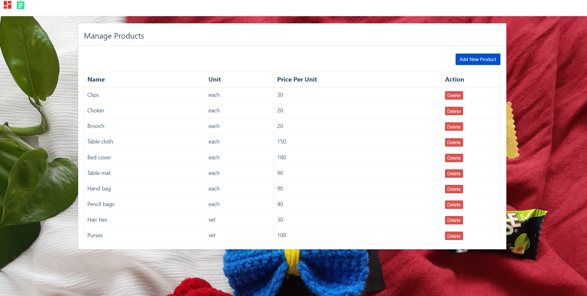

# python_projects_grocery_webapp
In this python project, we will build a store management application for the startup "Biyaas - Handmade with love". It will be 3 tier application,
1. Front end: UI is written in HTML/CSS/Javascript/Bootstrap
2. Backend: Python and Flask
3. Database: mysql

